# Standard Operating Procedure: Online Exam Platform

## Table of Contents

1. [Overview](#overview)
2. [Part A: Admin Operations](#part-a-admin-operations)
   - [A1. Login](#a1-login)
   - [A2. Dashboard](#a2-dashboard)
   - [A3. Candidate Management](#a3-candidate-management)
   - [A4. Exam Management](#a4-exam-management)
   - [A5. Question Management](#a5-question-management)
   - [A6. Viewing Results](#a6-viewing-results)
   - [A7. Logout](#a7-logout)
3. [Part B: Candidate Operations](#part-b-candidate-operations)
   - [B1. Login](#b1-login)
   - [B2. Dashboard](#b2-dashboard)
   - [B3. Taking an Exam](#b3-taking-an-exam)
   - [B4. Viewing Results](#b4-viewing-results)
   - [B5. Logout](#b5-logout)

---

## Overview

The Online Exam Platform is a web-based application for administering multiple-choice examinations. It has two user roles:

- **Admin** — Creates and manages candidates, exams, and questions. Reviews exam results.
- **Candidate** — Takes live exams and views their results.

Access the platform at your deployment URL and log in with your assigned username and password.

---

## Part A: Admin Operations

### A1. Login

1. Navigate to the platform URL. The login page is displayed.

   

2. Enter your **Username** and **Password**, then click **Sign In**.

   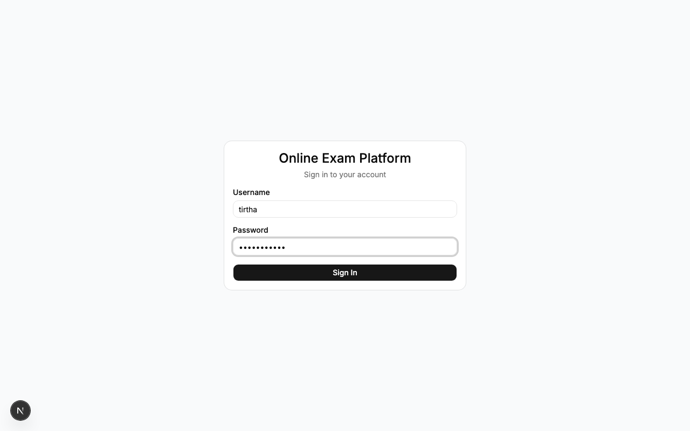

3. You will be redirected to the Admin Dashboard.

---

### A2. Dashboard

The Admin Dashboard displays a summary of platform activity:

- **Total Candidates** — Number of registered candidates
- **Total Exams** — Number of exams created
- **Completed Attempts** — Number of submitted exam attempts

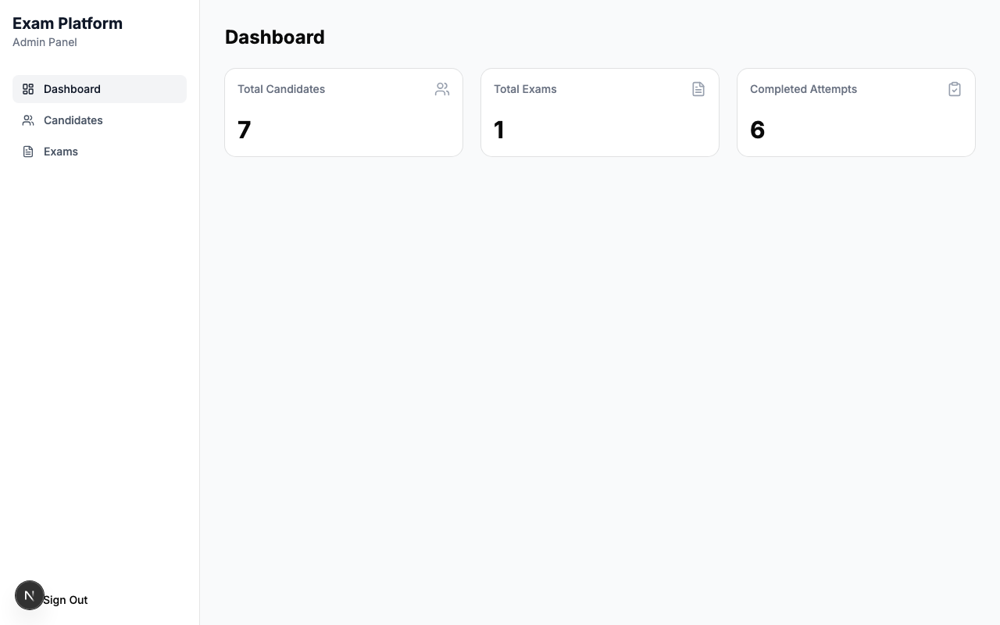

Use the left sidebar to navigate between **Dashboard**, **Candidates**, and **Exams**.

---

### A3. Candidate Management

#### Viewing Candidates

1. Click **Candidates** in the sidebar.
2. The candidates table displays all registered candidates with their **Name**, **Username**, and **Created** date.

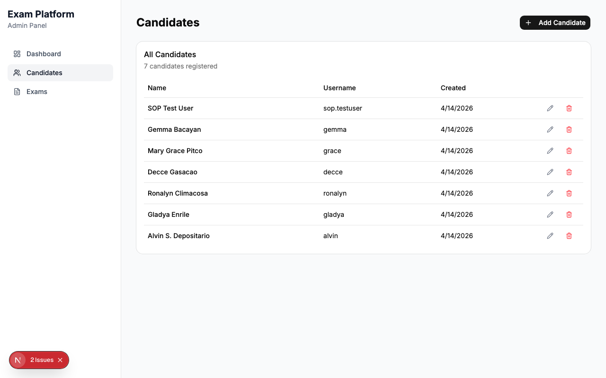

#### Creating a New Candidate

1. Click the **Add Candidate** button.

   

2. Fill in the following fields:
   - **Full Name** — The candidate's display name
   - **Username** — The login username (must be unique)
   - **Password** — The candidate's login password (minimum 6 characters)

   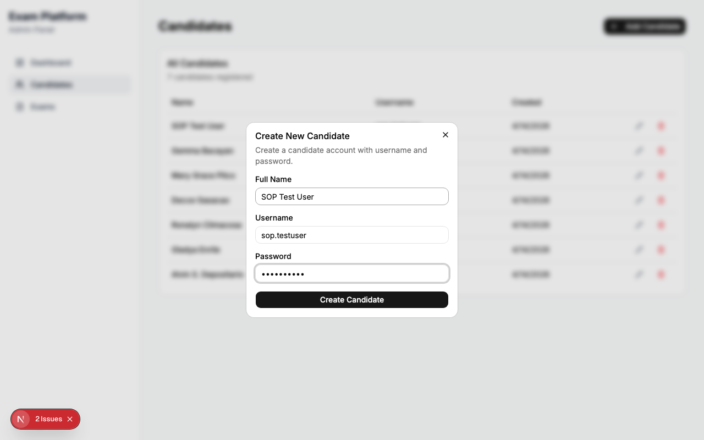

3. Click **Create Candidate**. A success notification will appear.

   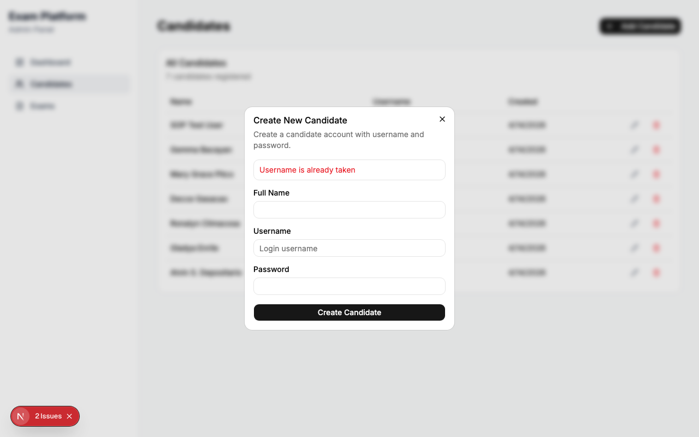

#### Editing a Candidate

1. Click the **pencil icon** next to the candidate you wish to edit.

   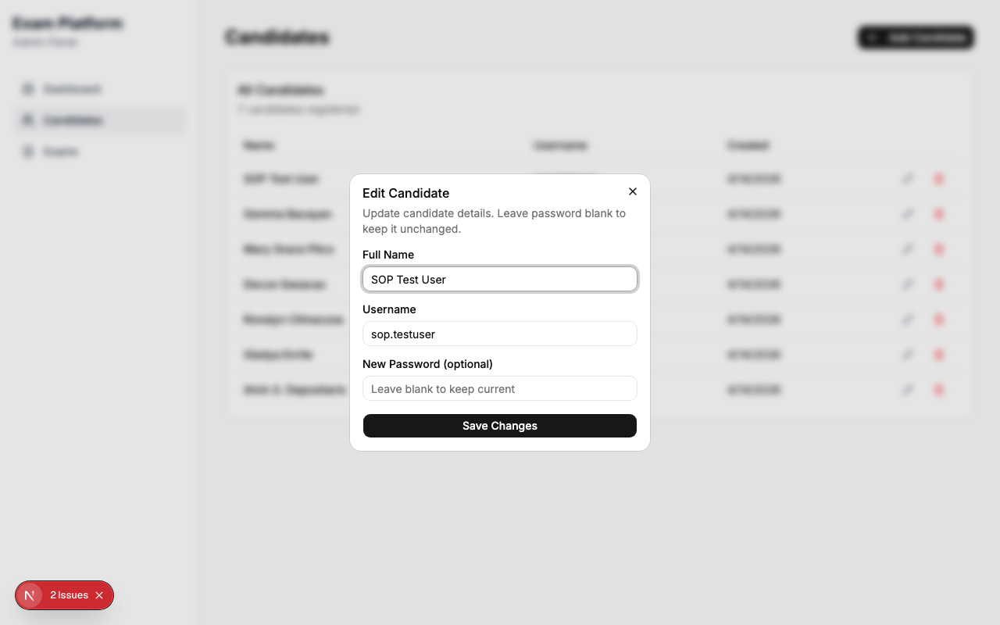

2. Modify the **Full Name**, **Username**, or set a **New Password** (leave password blank to keep the current one).
3. Click **Save Changes**.

#### Deleting a Candidate

1. Click the **trash icon** next to the candidate.
2. Confirm the deletion in the popup dialog.

---

### A4. Exam Management

#### Viewing Exams

1. Click **Exams** in the sidebar.
2. The exams table shows all exams with their **Title**, **Time Limit**, **Max Attempts**, and **Status** (Live or Draft).

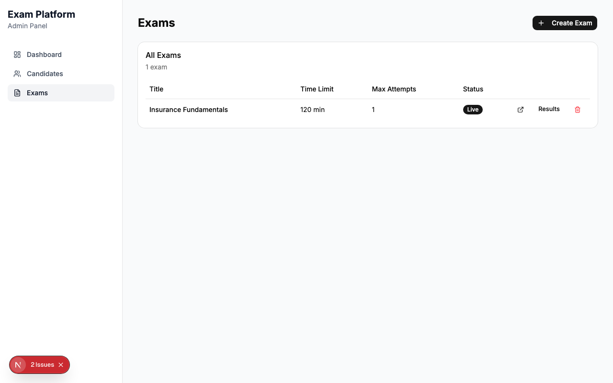

#### Creating a New Exam

1. Click the **Create Exam** button.

   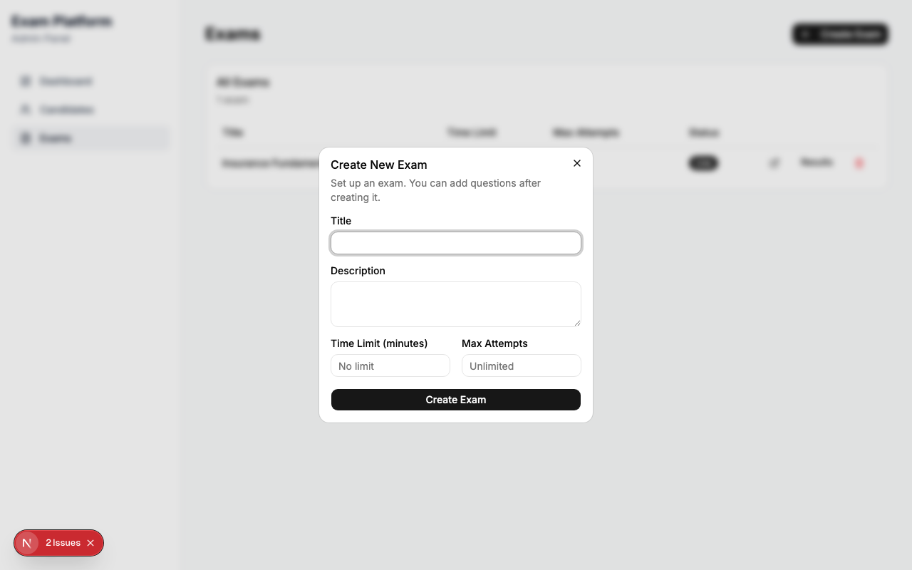

2. Fill in the following fields:
   - **Title** — The exam title displayed to candidates
   - **Description** — Optional description
   - **Time Limit (minutes)** — Leave blank for no time limit
   - **Max Attempts** — Leave blank for unlimited attempts

3. Click **Create Exam**. You will be redirected to the exam detail page.

#### Making an Exam Live

1. Open the exam detail page by clicking the **link icon** next to the exam.
2. In the **Status** section, click **Make Live** to publish the exam to candidates.

   

3. To unpublish, click **Set to Draft**.

> **Note:** Only **Live** exams are visible to candidates.

---

### A5. Question Management

#### Viewing Questions

1. Open an exam's detail page. Questions are listed below the exam settings.

   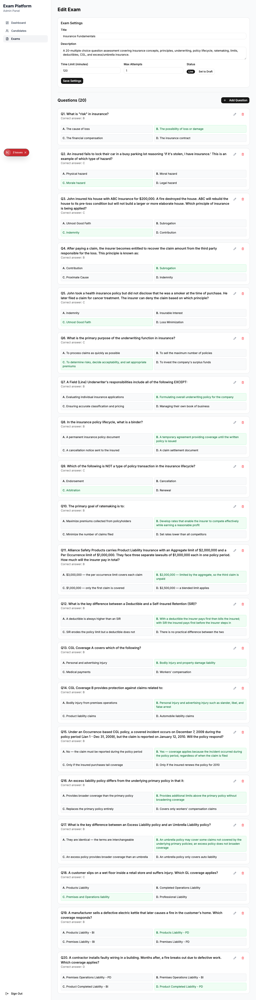

2. Each question shows the question text, all four options (A-D), and the correct answer highlighted in green.

   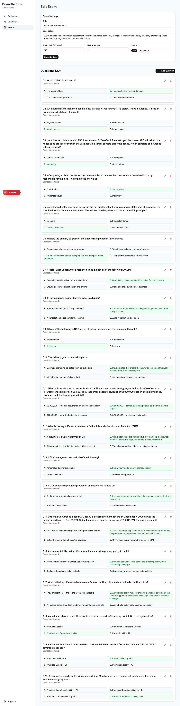

#### Adding a Question

1. Click the **Add Question** button.

   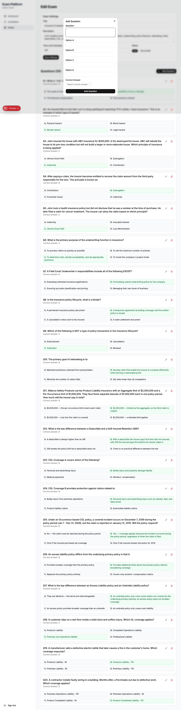

2. Fill in:
   - **Question** — The question text
   - **Option A through D** — The four answer choices
   - **Correct Answer** — Select A, B, C, or D

3. Click **Add Question**.

#### Editing a Question

1. Click the **pencil icon** on the question card.

   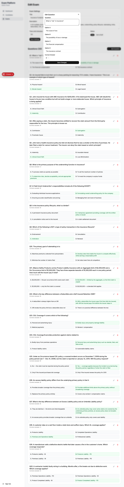

2. Modify the question text, options, or correct answer.
3. Click **Save Changes**.

#### Deleting a Question

1. Click the **trash icon** on the question card.
2. Confirm the deletion.

---

### A6. Viewing Results

#### Exam Results Overview

1. From the Exams list, click **Results** next to an exam.
2. A table displays all completed attempts with **Candidate name**, **Score**, **Percentage**, and **Submission time**.

   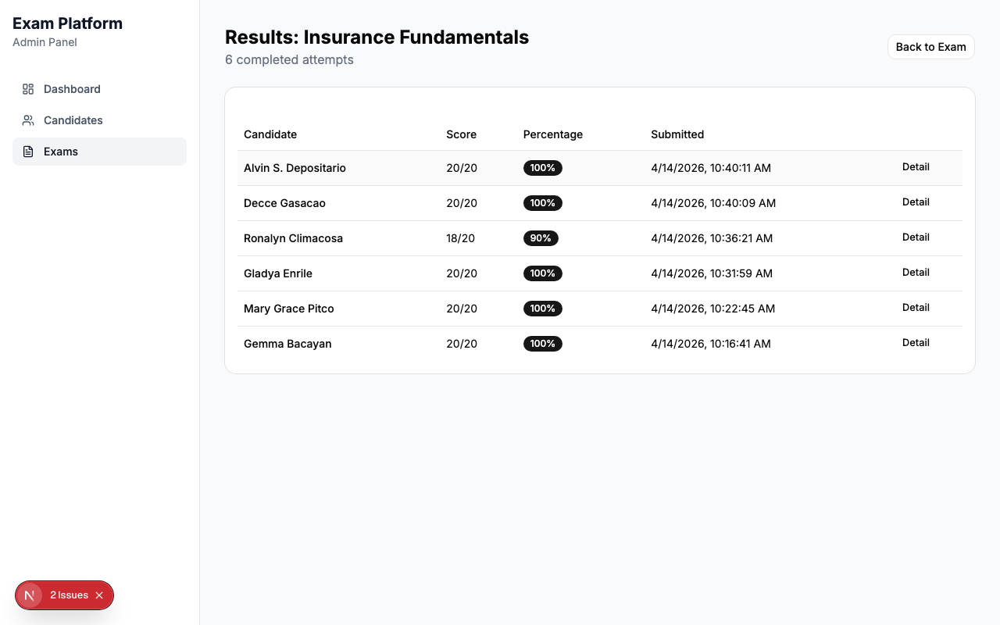

#### Individual Attempt Detail

1. Click **Detail** next to any attempt.
2. The detail page shows:
   - Candidate name, score, and percentage
   - Every question with the candidate's answer vs. the correct answer
   - Green indicates correct, red indicates incorrect

   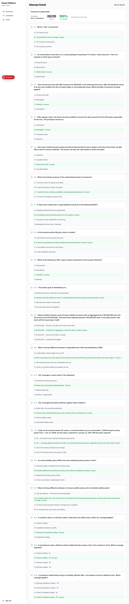

   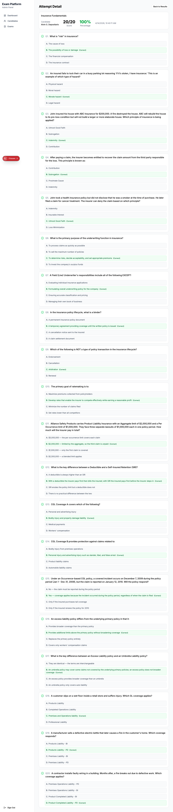

---

### A7. Logout

1. Click **Sign Out** at the bottom of the sidebar.
2. You will be redirected to the login page.

---

## Part B: Candidate Operations

### B1. Login

1. Navigate to the platform URL.
2. Enter your **Username** and **Password** provided by the admin.

   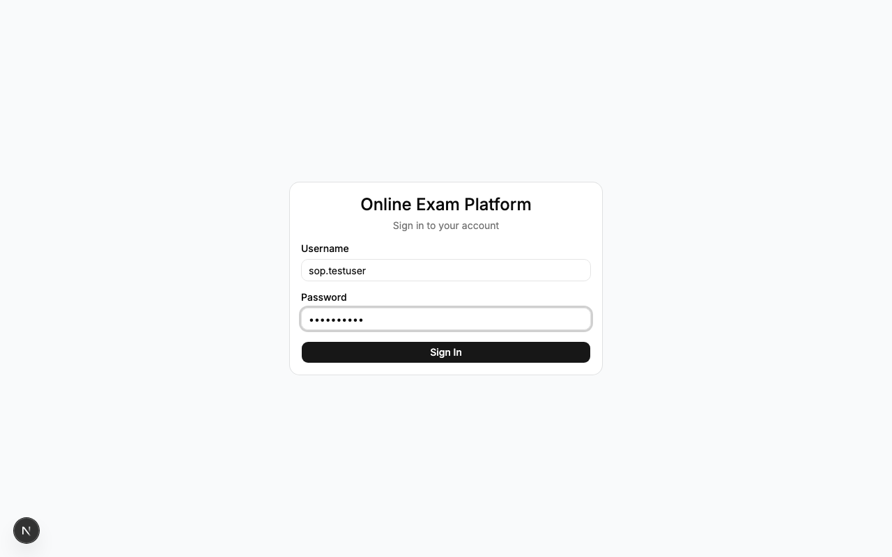

3. Click **Sign In**. You will be redirected to your Dashboard.

---

### B2. Dashboard

The Candidate Dashboard shows:

- **Available Exams** — Live exams you can take, with time limit and attempt count
- **My Results** — Your past exam attempts with scores

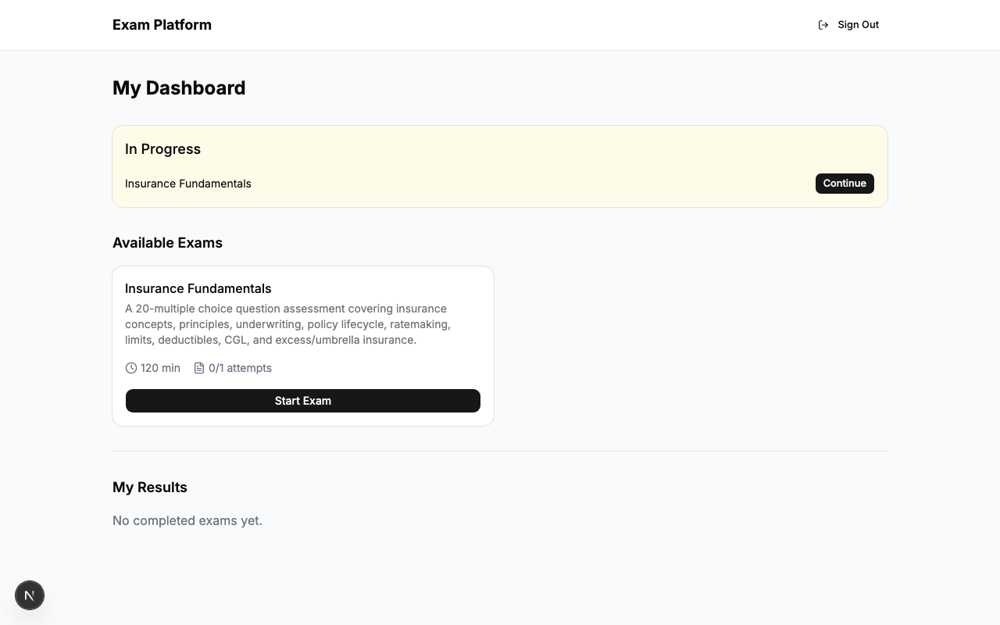

- Click **Start Exam** to begin a new attempt
- Click **Retake Exam** if you have remaining attempts
- Click **Review** to see detailed results of a past attempt

---

### B3. Taking an Exam

1. Click **Start Exam** on any available exam.
2. The exam page loads with:
   - **Exam title** and progress indicator (e.g., "5 of 20 answered")
   - **Countdown timer** (if the exam is timed) — displayed in the top-right
   - **All questions** displayed on a single scrollable page

   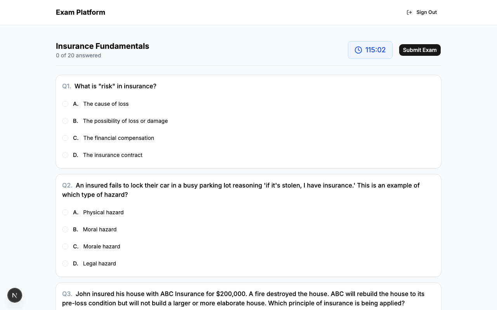

3. **Select your answer** by clicking the radio button next to your chosen option for each question.

   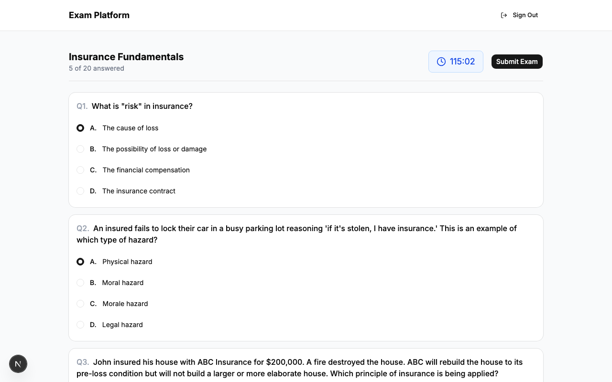

4. You can scroll through all questions and change your answers before submitting.

5. When ready, click **Submit Exam** (available at both the top and bottom of the page).

   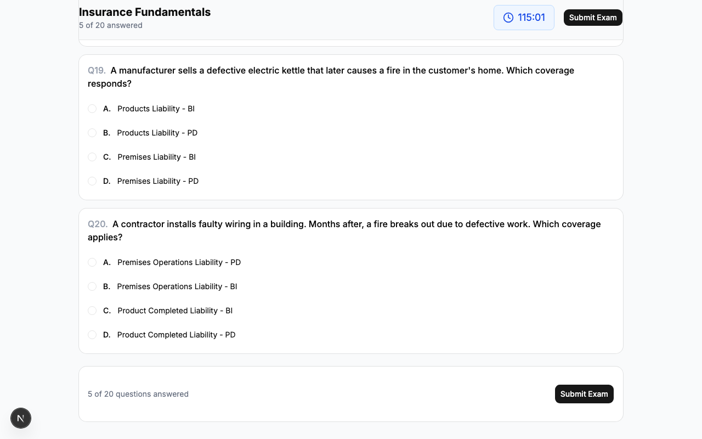

> **Important:**
> - If the exam is timed, it will **auto-submit when time runs out**.
> - If you navigate away from a timed exam, the clock keeps running.
> - Unanswered questions are marked as incorrect.

---

### B4. Viewing Results

After submitting, you are automatically taken to the results page.

1. The **score summary** shows your total score and percentage.

   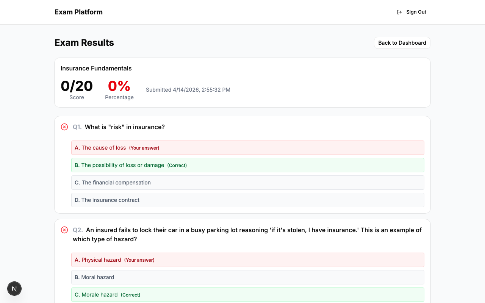

2. Below the summary, every question is displayed with:
   - A **green check** for correct answers, **red X** for incorrect
   - Your selected answer highlighted
   - The correct answer marked with "(Correct)"

   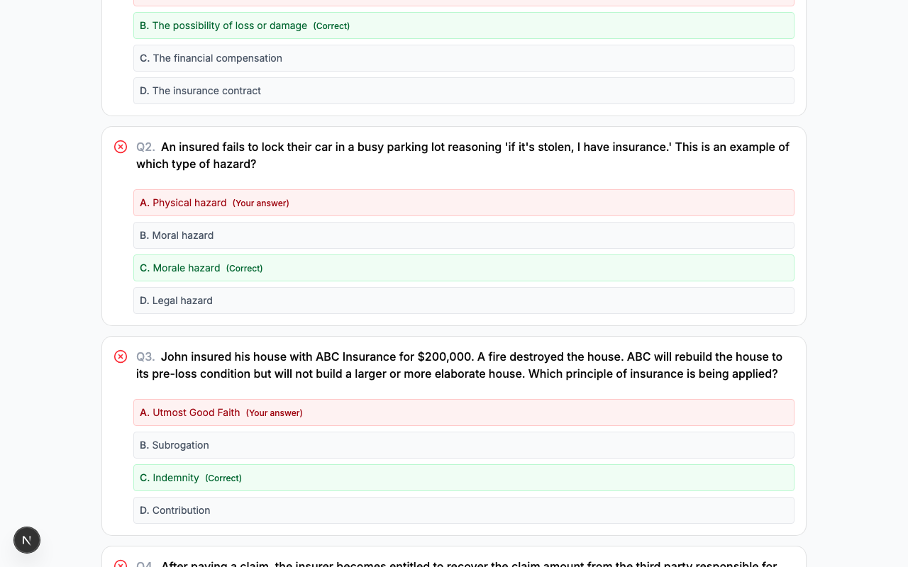

3. Click **Back to Dashboard** to return. Your attempt now appears under **My Results**.

   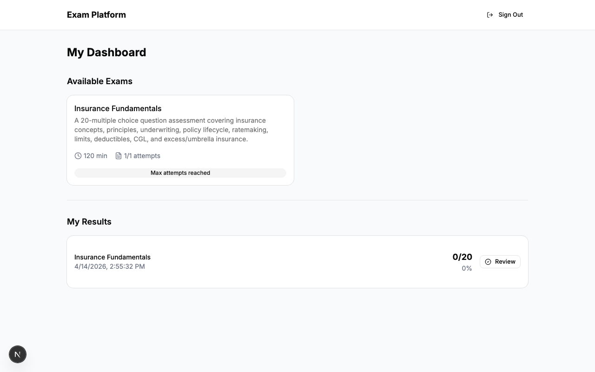

---

### B5. Logout

1. Click **Sign Out** in the top-right corner.
2. You will be redirected to the login page.

   

---

## Quick Reference

| Action | Role | Steps |
|---|---|---|
| Create candidate | Admin | Candidates > Add Candidate > Fill form > Create |
| Create exam | Admin | Exams > Create Exam > Fill form > Create |
| Add questions | Admin | Exams > Open exam > Add Question |
| Make exam live | Admin | Exams > Open exam > Make Live |
| View results | Admin | Exams > Results > Detail |
| Take exam | Candidate | Dashboard > Start Exam > Answer > Submit |
| Review results | Candidate | Dashboard > My Results > Review |
